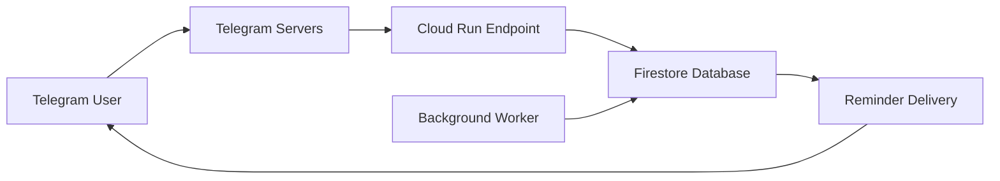

# Notifier

A Telegram bot to notify users about scheduled messages.

## Technical Specification

      

## Flow

### Chat - User Interaction

```text
User: /start
Bot: Please provide the password to continue.
User: ****
Bot: Password correct! You now have access.
User: Recordar en [#-unit]: [message].
Bot: Ok, te recordaré en [#-unit].
```

### Background

1. The bot is activated with "/start"
2. Log-in of the user is checked.
   1. If the user is verified, pass.
   2. If the user isn't verified, a password is asked.
      1. The password provided by the user is checked.
3. Check scheduled reminders in DB.
   1. If there are some reminders in DB, check the scheduled messages.
4. The user requests a reminder to be stored with a specific format.
5. The bot stores the request in index from Firestore and the message is scheduled.



### Features

1. Host the bot-service on Google Cloud Run
2. Schedule messages using Firestore and polling
3. Password authentication system
4. Interactive menu of commands
5. Verified accounts storage
6. Implement reminder management (list, delete)

### TODO

- [ ] #1 Migrate to Google Cloud Scheduler+Functions+Firestore

- [ ] #2 Support for different time units (hours, days)

- [ ] #3 Support for different time zones

- [ ] #4 Support for different languages

### Commands

```text
/start
/help
/listar
/eliminar
/status
```

---

## Branching and Release Strategy

This project provides **three parallel product variants**, each represented by its own branch. Each branch is a distinct product line and is maintained independently (not merged into each other).

### Branches (product variants)

- **`local`** → Standalone local version.  
  A self-contained variant that **does not** use cloud services (no Firestore, no GCP/AWS integrations). Useful for users who want an offline or simplified deployment.
- **`gcp`** → Variant for **Google Cloud Platform**.  
  Stable branch with GCP-specific integration and deployment configuration.
- **`aws`** → Variant for **Amazon Web Services**.  
  Stable branch with AWS-specific integration and deployment configuration.

> Important: these branches are *parallel* — they represent different builds/targets of the same product idea. Do **not** expect to merge them frequently. Instead, pick the branch that matches your deployment target.

### Master branch: landing & discovery

The repository's **`master`** branch is a **landing page** only (README + docs). It does **not** contain production code. `master` helps newcomers quickly understand which branch to use and how to get started.

### Tags & Releases

We use environment-prefixed tags to keep releases explicit:

- `local-v1.0.0` → Local release 1.0.0

- `gcp-v3.0.0` → GCP release 3.0.0

- `aws-v4.0.0` → AWS release 4.0.0

SemVer rules:

- Major (`X.0.0`) → Breaking changes or first release for a provider.

- Minor (`X.Y.0`) → New features without breaking compatibility.

- Patch (`X.Y.Z`) → Bugfixes and small improvements.

### How to clone a specific variant

Clone the branch that matches what you want to run:

```bash
# Clone local (standalone)
git clone -b local https://github.com/NihilMaster/notifier-telegram-bot.git

# Clone GCP variant
git clone -b gcp https://github.com/NihilMaster/notifier-telegram-bot.git

# Clone AWS variant
git clone -b aws https://github.com/NihilMaster/notifier-telegram-bot.git
```

## Documentation

### Google Cloud Platform Deployment

1. Create a GCP project with a billing account and the following APIs enabled:
    1. [Cloud Run API](https://console.cloud.google.com/apis/library/run.googleapis.com)
    2. [Cloud Firestore API](https://console.cloud.google.com/apis/library/firestore.googleapis.com)
2. Create a Cloud Firestore database in Native Mode.
3. Create the required composite index for Firestore:
   - Collection: `reminders`
   - Fields: `status` (Ascending), `trigger_time` (Ascending)
   - Or use the automatic link from error [logs](https://console.cloud.google.com/logs/query;storageScope=project)
4. Grant permissions to the service account of the Cloud Run service:
   - Role: `roles/firestore.user`.
   - Service account name: `[PROJECT-NUMBER]-compute@developer.gserviceaccount.com`.
5. Deploy the bot to Cloud Run:

   ```powershell
   # Deploy
   gcloud run deploy telegram-bot `
    --source . `
    --platform managed `
    --region us-central1 `
    --allow-unauthenticated `
    --memory 1Gi `
    --cpu 1 `
    --port 8080 `
    --set-env-vars=BOT_TOKEN=<your-bot-token> `
    --set-env-vars=BOT_PASSWORD=<random-password> `
    --max-instances=1 `
    --timeout=60s

   # Verify
   ## Test Cloud Run endpoint
   curl -X POST (gcloud run services describe telegram-bot --region us-central1 --format="value(status.url)") -H "Content-Type: application/json" -d '{"test": "health"}'

   ## Variables
   gcloud run services describe telegram-bot `
    --region us-central1 `
    --format="yaml(spec.template.spec.containers[0].env)"
   ```

    Otherwise, you can check the [logs](https://console.cloud.google.com/logs/query;storageScope=project) for verify the deployment.

### Firestore Database Structure

**Collection**: `reminders`

**Document fields**:

- `chat_id` (string): Telegram chat ID
- `minutes` (number): Minutes until reminder
- `message` (string): Reminder message content  
- `trigger_time` (number): Unix timestamp for reminder
- `created_time` (number): Unix timestamp of creation
- `status` (string): 'pending' or 'completed'
- `completed_time` (number): Unix timestamp of completion (optional)

**Collection**: `verified_users`

**Document fields**:

- `chat_id` (string): Telegram chat ID
- `last_activity` (number): Unix timestamp of last activity
- `verification_date` (number): Unix timestamp of verification

**Required Index**:

- Composite index on: `status` (ASC), `trigger_time` (ASC)
