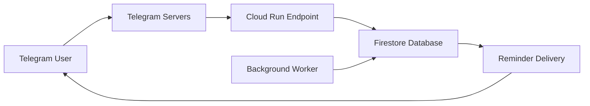

# Notifier

## Flow

### Chat - User Interaction

```text
User: /start
Bot: Please provide the password to continue.
User: ****
Bot: Password correct! You now have access.
User: Recordar en [#-unit]: [message].
Bot: Ok, te recordaré en [#-unit].
```

### Background

1. The bot is activated with "/start"
2. Log-in of the user is checked.
   1. If the user is verified, pass.
   2. If the user isn't verified, a password is asked.
      1. The password provided by the user is checked.
3. Check scheduled reminders in DB.
   1. If there are some reminders in DB, check the scheduled messages.
4. The user requests a reminder to be stored with a specific format.
5. The bot stores the request in index from Firestore and the message is scheduled.



---

## Tasks

- [x] #1 Host the bot on Google Cloud Platform ✓
- [x] #2 Schedule messages using Firestore and polling ✓  
- [x] #3 Implement password authentication system ✓
- [ ] #4 Create an interactive menu of commands
- [ ] #5 Add support for different time units (hours, days)
- [ ] #6 Implement reminder management (list, delete, update)

---

## Documentation

### Google Cloud Platform Deployment

1. Create a GCP project with a billing account and the following APIs enabled:
    1. [Cloud Run API](https://console.cloud.google.com/apis/library/run.googleapis.com)
    2. [Cloud Firestore API](https://console.cloud.google.com/apis/library/firestore.googleapis.com)
2. Create a Cloud Firestore database in Native Mode.
3. Create the required composite index for Firestore:
   - Collection: `reminders`
   - Fields: `status` (Ascending), `trigger_time` (Ascending)
   - Or use the automatic link from error [logs](https://console.cloud.google.com/logs/query;storageScope=project)
4. Grant permissions to the service account of the Cloud Run service:
   - Role: `roles/firestore.user`.
   - Service account name: `[PROJECT-NUMBER]-compute@developer.gserviceaccount.com`.
5. Deploy the bot to Cloud Run:

   ```powershell
   # Deploy
   gcloud run deploy telegram-bot `
    --source . `
    --platform managed `
    --region us-central1 `
    --allow-unauthenticated `
    --memory 1Gi `
    --cpu 1 `
    --port 8080 `
    --set-env-vars=BOT_TOKEN=<your-bot-token>,BOT_PASSWORD=<random-password>
    --max-instances=1 `
    --timeout=60s

   # Verify
   ## Test Cloud Run endpoint
   curl -X POST (gcloud run services describe telegram-bot --region us-central1 --format="value(status.url)") -H "Content-Type: application/json" -d '{"test": "health"}'

   ## Variables
   gcloud run services describe telegram-bot `
    --region us-central1 `
    --format="yaml(spec.template.spec.containers[0].env)"


   ```

    Otherwise, you can check the [logs](https://console.cloud.google.com/logs/query;storageScope=project) for verify the deployment.

### Firestore Database Structure

**Collection**: `reminders`

**Document fields**:

- `chat_id` (string): Telegram chat ID
- `minutes` (number): Minutes until reminder
- `message` (string): Reminder message content  
- `trigger_time` (number): Unix timestamp for reminder
- `created_time` (number): Unix timestamp of creation
- `status` (string): 'pending' or 'completed'
- `completed_time` (number): Unix timestamp of completion (optional)

**Required Index**:

- Composite index on: `status` (ASC), `trigger_time` (ASC)
